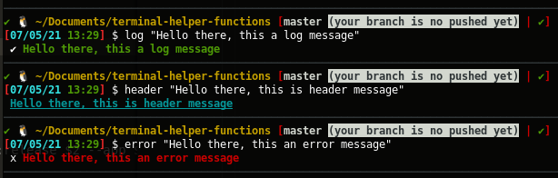
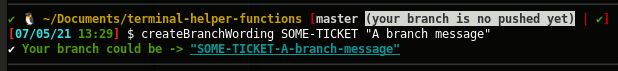
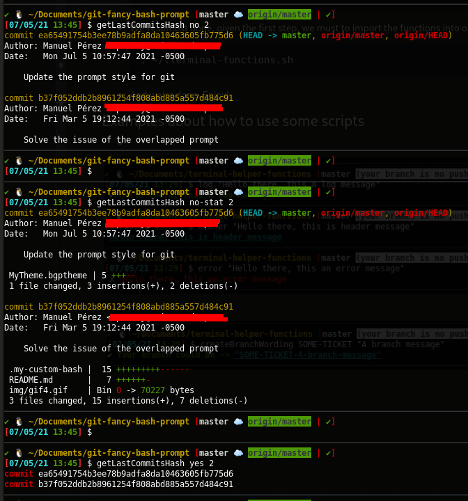

# Terminal Helper Functions

## How to use

- We need to import these functions in our `~/.bashrc` file, but first let's copy the `.terminal-functions.sh` and `reset_teamviewer.sh` files in user home directory `~`.

- After te first step, we must change the permissions of both files:
    ```
    $ sudo chmod 777 .terminal-functions.sh reset_teamviewer.sh
    ```

- We're almost done, given the first step, we must to import the functions into our `~/.bashrc` file inserting the next as follows:
    ```
    . ~/.terminal-functions.sh
    ```

- Now we must reset or open a new terminal and we're done. Enjoy!

## Examples about how to use some scripts

- 


-


-
